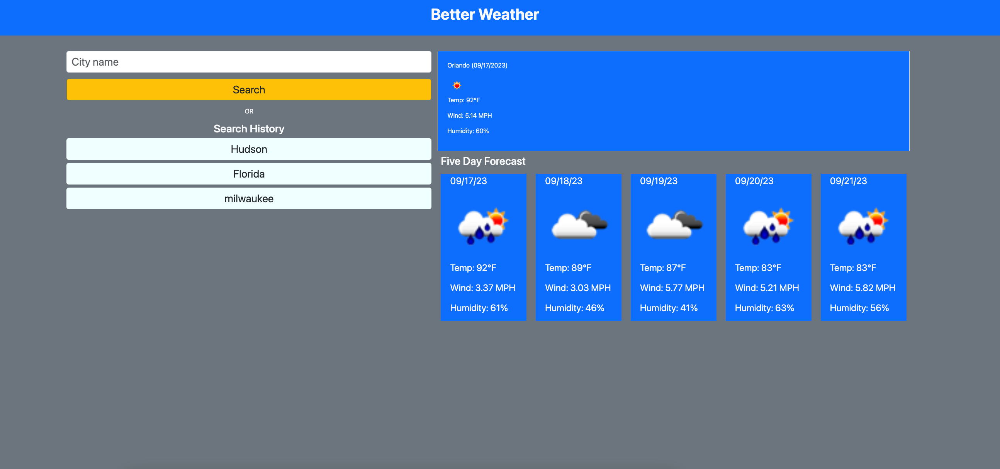

# Better Weather

Better weather helps you keep track of the weather around the world in a very simple way.

## Technologies

- JavaScrip
- jQuery
- HTML
- BOOTSTRAP
- CSS
- Dayjs
- OpenWeatherApi

## Reason for building

### I have build a similar application in the past but I have always felt like i could do a better job so I built this one which I am very proud of.

## What I have learned

- I have enhanced my ability to work with API's (Widen my understanding with clear purpose).
- Project completion is a great feeling.
- Understanding the ins and outs of Bootstrap and jQuery.
- Being discipline is more important than being motivated.
- Enhance my algorithmic thinking and data structuring.

## Deployed Application
[Live](https://dodor101.github.io/better-weather-app/)

## Credits
 Duckenson Dodor